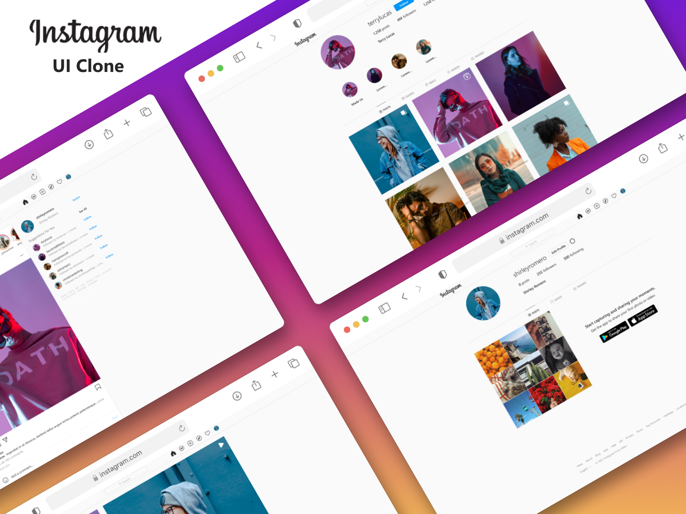

# Instagram Clone - Next.js and React Application

This is a project that aims to create an Instagram clone using Next.js and React. The project is bootstrapped with create-next-app to provide a solid foundation for building a modern web application.



## Getting Started

To begin working on the project, follow these steps:

1. Clone the repository to your local machine.
2. Install the required dependencies by running the following command:

   ```bash
        npm install
        # or
        yarn install
        # or
        pnpm install
   ```

3. Create .env file and fill the variables.
4. Start the development server with the following command:

   ```bash
       npm run dev
       # or
       yarn dev
       # or
       pnpm dev
   ```

5. Open your browser and navigate to http://localhost:3000 to see the application in action. The development server supports hot-reloading, so any changes you make will automatically reflect in the browser.

# Dependency Overview

In this section, we'll provide a brief explanation of the most common libraries and dependencies used in your Instagram Clone project.

| Dependency                              | Description                                                                                                                                                                                 |
| --------------------------------------- | ------------------------------------------------------------------------------------------------------------------------------------------------------------------------------------------- |
| @hookform/resolvers and react-hook-form | `react-hook-form` is used for form handling in React applications. `@hookform/resolvers` provides additional validation resolvers for `react-hook-form`.                                    |
| @mui/material                           | Material-UI (MUI) is a popular React UI framework that provides pre-designed components following the Material Design principles.`@mui/material` is the package for MUI's core components.  |
| @tanstack/react-query                   | `react-query` is used for data fetching and caching in React applications. It simplifies data management and improves the performance of your app by handling asynchronous data operations. |
| dayjs                                   | Day.js is a minimalist JavaScript library for working with dates and times. It provides an alternative to the built-in `Date` object, offering a more flexible and lightweight solution.    |
| emoji-picker-react                      | This library allows users to select emojis from a picker. It's often used to enhance user interactions with emojis in text fields or messages.                                              |
| firebase                                | Firebase is a comprehensive backend-as-a-service platform by Google. It provides various services such as authentication, real-time database, cloud storage, and more.                      |
| tailwindcss                             | Tailwind CSS is a utility-first CSS framework that provides pre-defined classes to style your components. It promotes a rapid and consistent styling approach.                              |
| typescript                              | TypeScript is a superset of JavaScript that adds static typing to the language. It enhances code quality, provides better tooling, and improves maintainability.                            |
| zod                                     | Zod is a TypeScript-first runtime validation library. It helps you define and validate data shapes, making it useful for ensuring data integrity.                                           |

## Backend with Firebase

This Instagram clone utilizes Firebase as a backend as a service (BaaS) solution. Firebase provides various services like authentication, real-time database, storage, and more. You can set up your Firebase project and integrate it with this application to handle user authentication, post storage, and other features.

Here's a brief overview of how Firebase is integrated into this project:

- **Authentication** : Firebase Authentication is used to manage user authentication. Users can sign up, log in, and log out securely.
- **Real-time Database** : Firebase Realtime Database is utilized to store and retrieve posts, user information, and other data in real time.
- **Storage** : Firebase Storage is used to store images and other media associated with user posts.

## What I've Learned

Throughout the process of working on this Instagram Clone project, I've gained valuable experience and knowledge in several key areas:

1. **Intercepting Routes** : I've grasped the concept of middleware-like functionality in Next.js, which has allowed me to control the flow of navigation and apply logic before a page is displayed. This offers a seamless and customized user experience.
2. **Firebase Integration** : Integrating Firebase as a backend-as-a-service platform has exposed me to cloud services such as authentication, real-time databases, and cloud storage. This experience enables me to build scalable and feature-rich applications that interact with the cloud seamlessly.
3. **Styling and UI Libraries** : I've utilized libraries like Material-UI and Tailwind CSS to enhance the aesthetics of my application. This involved using pre-designed components and utility classes to create visually appealing and responsive user interfaces.
4. **Asynchronous Data Management** : Through incorporating `react-query`, I've acquired hands-on experience in efficient data fetching and caching. This library has enabled me to optimize data management, enhance performance, and provide smooth user interactions.
5. **Custom Hooks and Form Handling** : I've developed custom hooks and used libraries like `react-hook-form` to manage form input and validation effectively. This skill is crucial for creating interactive and user-friendly forms.
6. **Date and Time Handling** : Through the use of the `dayjs` library, I've learned how to manipulate dates and times efficiently. This knowledge is essential for managing time-related functionalities within my application.
7. **Error Handling and Debugging** : As part of my development process, I've encountered and resolved various errors and issues. This hands-on experience with debugging techniques will prove invaluable as I continue to work on more complex projects.

Overall, my work on this Instagram Clone project has provided me with a solid foundation in TypeScript, Next.js, Firebase integration, routing, UI design, and asynchronous data management. These skills are transferable and can be applied to a wide range of web development projects.

## Contributing

We welcome contributions to enhance and improve this project! Whether you're an experienced developer or just starting out, there are various ways you can contribute:

-**Bug Reports and Feature Requests**: If you find a bug or have an idea for a new feature, please [open an issue](https://github.com/AnisKehila/instagram-clone/issues) so we can discuss it and track progress.

-**Code Contributions**: If you'd like to contribute code, feel free to fork the repository, make your changes, and submit a [pull request](https://github.com/AnisKehila/instagram-clone/pulls). We'll review your changes and work together to merge them.

## Getting Started

To start contributing, follow these steps:

1. Fork the repository: [https://github.com/AnisKehila/instagram-clone](https://github.com/AnisKehila/instagram-clone)
2. Clone your forked repository locally.
3. Create a new branch for your changes: `git checkout -b feature-name`
4. Make your changes, commit them, and push to your fork.
5. Submit a pull request to the original repository.

Thank you for helping to improve this project! 🚀

## License

This project is licensed under the [MIT License](LICENSE).

You are free to use, modify, and distribute the software in accordance with the terms of the MIT License. Please refer to the [LICENSE](LICENSE) file for more details.
